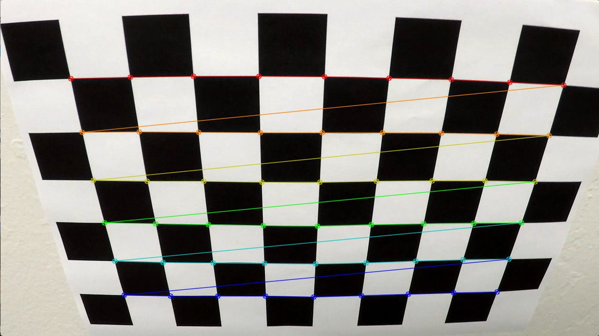
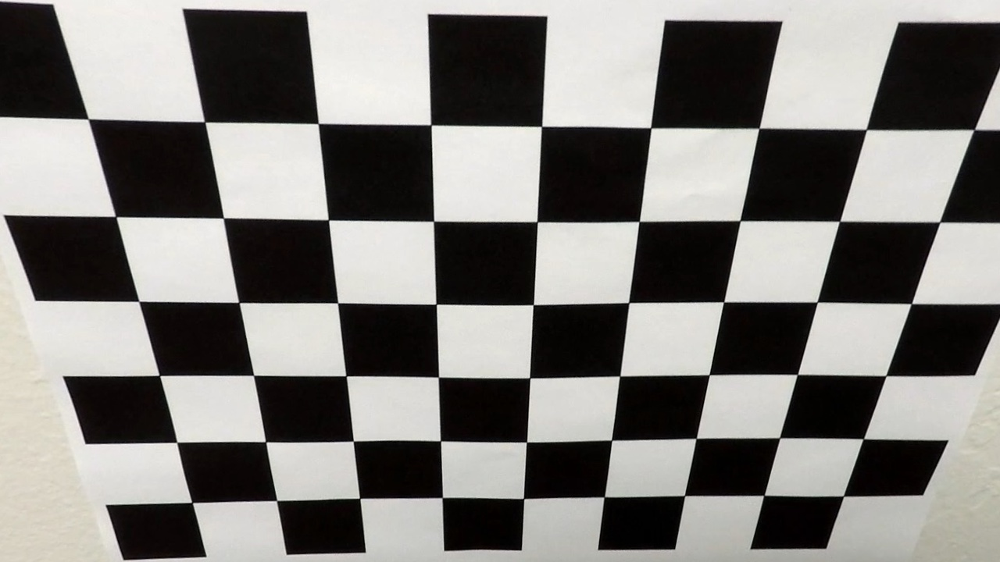
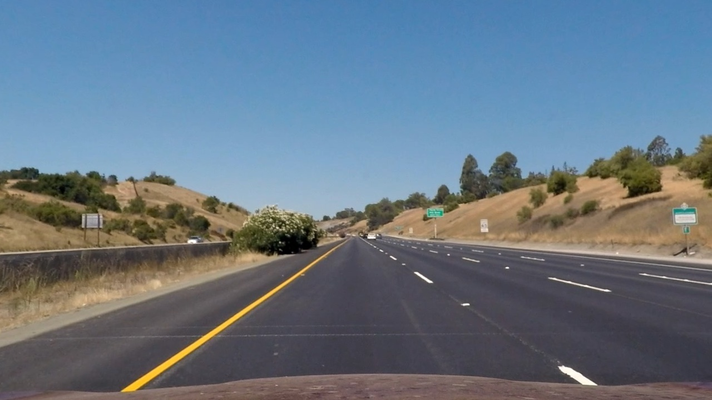
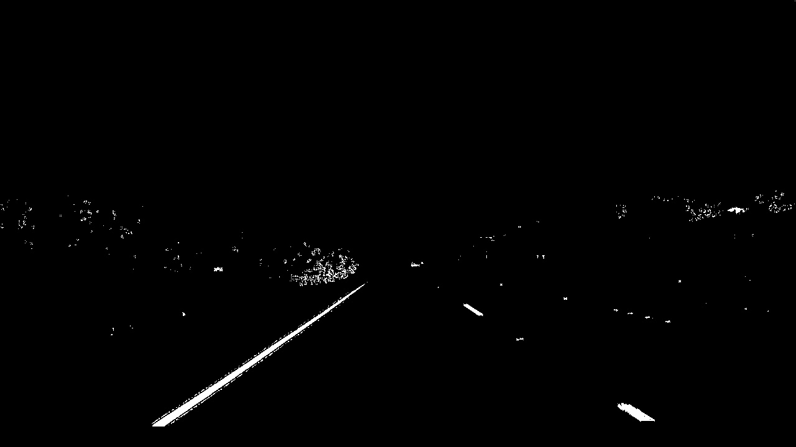
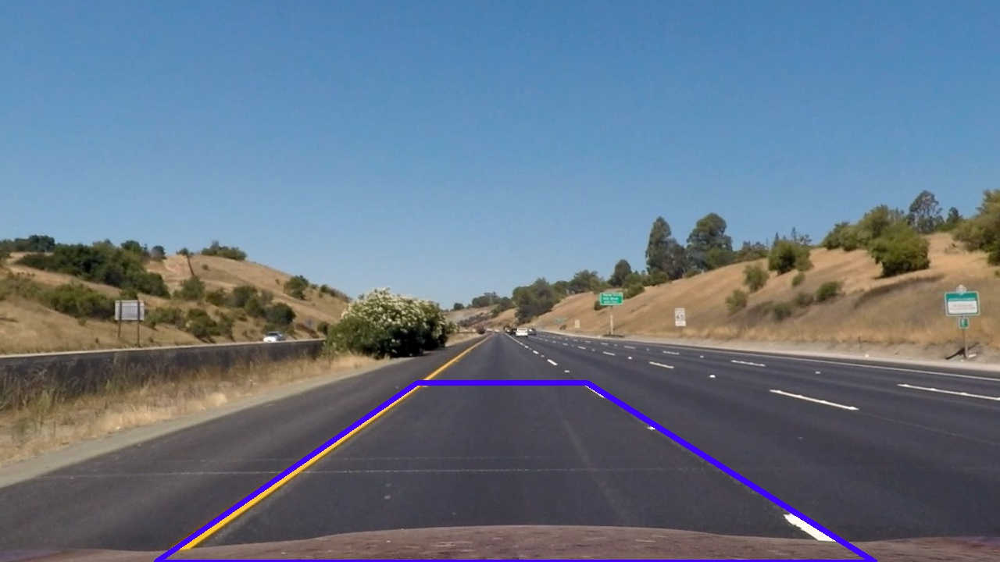
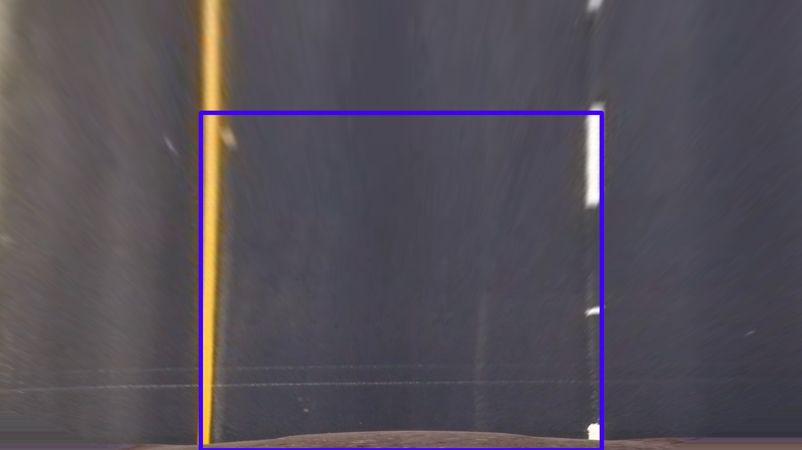
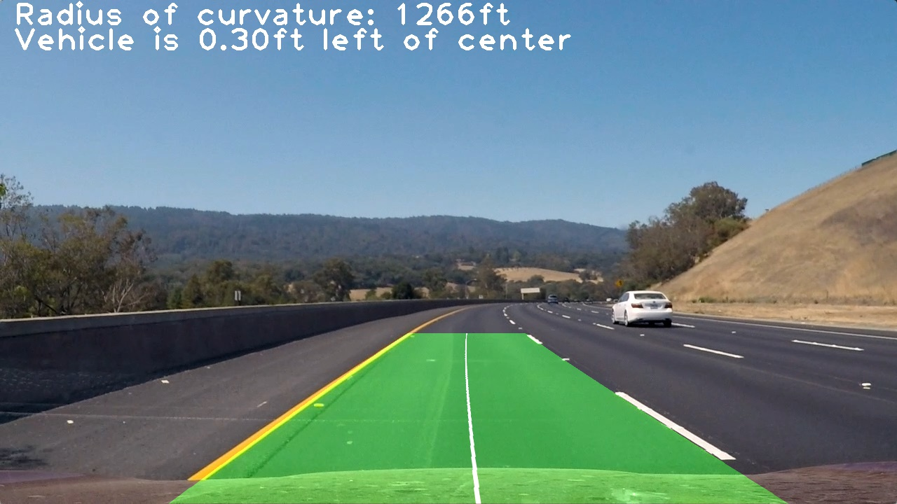

# Advanced Lane Finding Project

Author: Roman Stanchak<br/>
Date: 2017-05-28<br/>
Udacity Self Driving Car Nanodegree Term 1

The goals / steps of this project are the following:

* Compute the camera calibration matrix and distortion coefficients given a set of chessboard images.
* Apply a distortion correction to raw images.
* Use color transforms, gradients, etc., to create a thresholded binary image.
* Apply a perspective transform to rectify binary image ("birds-eye view").
* Detect lane pixels and fit to find the lane boundary.
* Determine the curvature of the lane and vehicle position with respect to center.
* Warp the detected lane boundaries back onto the original image.
* Output visual display of the lane boundaries and numerical estimation of lane curvature and vehicle position.

[//]: # (Image References)

[image1]: ./examples/undistort_output.png "Undistorted"
[image2]: ./test_images/test1.jpg "Road Transformed"
[image3]: ./examples/binary_combo_example.jpg "Binary Example"
[image4]: ./examples/warped_straight_lines.jpg "Warp Example"
[image5]: ./examples/color_fit_lines.jpg "Fit Visual"
[image6]: ./examples/example_output.jpg "Output"
[video1]: ./project_video.mp4 "Video"

## [Rubric](https://review.udacity.com/#!/rubrics/571/view) Points

### Here I will consider the rubric points individually and describe how I addressed each point in my implementation.  

---

### Writeup/README

#### 1. Provide a Writeup
This document describes my approach to the Advanced Lane Finding project

### Camera Calibration
#### 1. Briefly state how you computed the camera matrix and distortion coefficients. Provide an example of a distortion corrected calibration image.

To compute the camera matrix, I implemented the following steps:
1. Find image points in images corresponding to a reference calibration object.  In this case, a chessboard pattern.
2. Input image and object point correspondence to OpenCV calibration function.

The image below shows an example of the detected chessboard pattern:

 

The example below shows a calibration image before and after distortion correction

| Original | Corrected |
|:---------|:----------|
|  | |

### Pipeline (single images)

#### 1. Provide an example of a distortion-corrected image.

The example below shows a test image before and after distortion correction

| Original | Corrected |
|:---------|:----------|
|  | |

#### 2. Describe how (and identify where in your code) you used color transforms, gradients or other methods to create a thresholded binary image.  Provide an example of a binary image result.

To create a binary thresholded images, I used the following components:

| Component | Description |
|:----------|:------------|
| $v$       | V Channel of HSV colorspace image |
| $s$       | S Channel of HLS colorspace image |
| $|I_x|$   | Absolute gradient in X direction  |
| $|I_y|$   | Absolute gradient in Y direction |

To produce the final binary image, these components are thresholded and combined as follows:

$(v>thresh_v$  AND $s>thresh_s)$ OR $(|I_x|>thresh_{I_x}$ AND $|I_y|>thresh_{I_y}) $

The threshold values were chosen empirically to maximize lane pixels and minimize noise on the test images.  A sample is shown below

| Original | Thresholded |
|:---------|:------------|
|  | |

#### 3. Describe how (and identify where in your code) you performed a perspective transform and provide an example of a transformed image.

I chose to hard code the input region of interest.  Using one of the 'straight_line' images, I identified a trapezoid that appeared to create a tight rectangular bounding box around a lane.  I computed the perspective transform to a rectangular region in the image with padding on the top and sides to capture the surrounding
image area.  An example is shown below:

| Original | Transformed |
|:---------|:------------|
|  | |

#### 4. Describe how (and identify where in your code) you identified lane-line pixels and fit their positions with a polynomial?

To identify lane line pixels and fit their positions with a polynomial, I used the following algorithm:
1. Convolve the binary image result with a of gaussian of width=49 and height=3.  The intent was to produce a large filter response in the center of the lane lines.
2. For each Y, determine the local maximum in the X-direction in a small window at the expected lane positions. 
3. If the maximum value > 0, save the (X,Y) pair to a list of lane-line pixels to fit to a polynomial.  Reject the (X,Y) pair if the maximum value is 0 (i.e. no lane marking found at this Y value)
4. Repeat for left and right lanes.
5. Fit the lane points to the lane width and a curve representing the lane center 
6. Extrapolate the left and right lane borders based on the computed lane center and lane width.

Step 5 requires a bit more explanation:

The lane center is modeled with a second order polynomial 

$f(y) = Ay^2 + By + C$

The lane lines $f_{left}$ and $f_{right}$ are the same polynomial shifted left and right by half the lane width $w$:

$f_{left}(y) = Ay^2 + By + C - w/2$

$f_{right}(y) = Ay^2 + By + C + w/2$

The parameters A,B,C and w are unknown, but linear.  Solving in least squares fashion by stacking constraints is straightforward.

let $\mathbf{x}=\mathbf{Y}\mathbf{\beta}$

where 

$\mathbf{\beta} = [A, B, C, w]$

$\mathbf{x} = [x_1, x_2, ... x_n]$

$\mathbf{Y} = [Y_1, Y_2, ... Y_n]^T$

and

$Y_i = [y_i^2, y_i, 1, \alpha]$

and

$\alpha=-0.5$ for left lane points
$\alpha=0.5$ for right lane points

The least squares solution $\mathbf{\hat{\beta}}$ (as given by <a href="https://en.wikipedia.org/wiki/Linear_least_squares_(mathematics)">Wikipedia - Linear least squares</a>) is

$\mathbf{\hat{\beta}} = (\mathbf{Y}^T\mathbf{Y})^{-1}\mathbf{Y}^T\mathbf{x}$

I chose to use this approach in order to fit a curve more robustly to the detected lane points.  I had some trouble fitting the dashed-lane line when there were few datapoints.  Fitting all 4 parameters simultaneously to the measurements proved less prone to sparse lane points.

Another approach I implemented to make the fit more robust is including a generated dataset from the curve estimated in the previous frame.  This had the effect of averaging the effect of new measurements with the current estimated lane curve and overcoming instances when thresholding failed or lane pixels were not detected in the correct position.

#### 5. Describe how (and identify where in your code) you calculated the radius of curvature of the lane and the position of the vehicle with respect to center.

To compute the radius of curvature, I first computed the equivalent polynomial curve in world space using empirical scaling factor $s_x$ of 12ft/647 pixels in the X direction and $s_y$ of 10ft/180 pixels in the Y direction.  Then, I used the given curvature equation to compute the curvature from the polynomial coefficients:

$R_{curve} = ((1+(2Ay+B)^2)^{3/2}) / (|2A|)$

with $y = s_y * image.height$

To compute the position with respect to the center, I assumed that the center of the image is the center of the vehicle and computed the difference in X position with the polynomial curve in image coordinates.  This value was scaled by $s_x$ to determine the offset in real-world coordinates.


#### 6. Provide an example image of your result plotted back down onto the road such that the lane area is identified clearly.



---

### Pipeline (video)

#### 1. Provide a link to your final video output.  Your pipeline should perform reasonably well on the entire project video (wobbly lines are ok but no catastrophic failures that would cause the car to drive off the road!).

<a href="results/project_video.mp4">Project Video Result</a>

---

### Discussion

#### 1. Briefly discuss any problems / issues you faced in your implementation of this project.  Where will your pipeline likely fail?  What could you do to make it more robust?

My pipeline assumes that the left lane is in the left half of the image and the right lane is the right half.  It fails when the road curvature or center position is such that this assumption is violated.

To make the pipeline more robust I would:
* use robust statistics and/or clustering methods to fit grouped lane pixels more closely and ignore outliers
* use known information about the road curvature to guide the fit (i.e. it will fall within an expected range and will vary slowly)
* use the image gradient to refine the lane boundaries more precisely


```python

```
